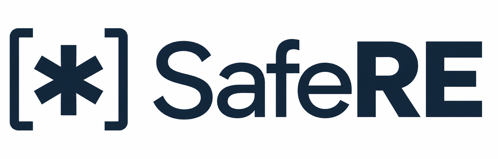

**Safe, correct, and fast regular expressions for Java.**

- **Safe:** Guaranteed linear-time matching for a fixed compiled pattern.
  SafeRE's finite automata prevent catastrophic backtracking by construction,
  blocking [regular expression denial-of-service (ReDoS) attacks](https://en.wikipedia.org/wiki/ReDoS)
  that exploit it.
- **Correct:** Built for production use, targeting `java.util.regex` compatibility
  within that guarantee. Extensive [validation](docs/TESTING.md) includes JDK
  differential testing, exhaustive sweeps, fuzzing, and regression coverage.
- **Fast:** Substantially faster than the JDK regex engine on most workloads and competitive with
  leading native engines in both our own benchmarks and [Rebar](https://github.com/BurntSushi/rebar)'s independently
  developed benchmark suite. See the
  [performance results](#performance) for workload comparisons and tradeoffs.

Features include:

- Java-style `Pattern` and `Matcher` APIs, including named captures and replacement.
- Unicode properties, case folding, and grapheme matching.
- [Direct UTF-8 input](docs/UTF8.md) for applications that already own text as bytes.
- [Multi-pattern matching](docs/PATTERN_SET.md) for checking a set of rules.
- [Diagnostics](docs/DIAGNOSTICS.md) for inspecting patterns and observing execution.

SafeRE supports a subset of Java regex syntax. Backreferences, lookaround,
atomic groups, possessive quantifiers over consuming operands, `\G`, and `\C`
are rejected, as are counted repetitions above 1000. `CANON_EQ`,
`Matcher.hitEnd()`, and `Matcher.requireEnd()` are unsupported. See
[syntax and compatibility](docs/SYNTAX.md) for the complete list before
migrating an application.

## Installation

Requires **Java 21 or later**. Releases are available on
[Maven Central](https://central.sonatype.com/artifact/org.safere/safere).

Maven:

```xml
<dependency>
  <groupId>org.safere</groupId>
  <artifactId>safere</artifactId>
  <version>0.11.0</version>
</dependency>
```

Gradle (Kotlin DSL):

```kotlin
implementation("org.safere:safere:0.11.0")
```

Gradle (Groovy DSL):

```groovy
implementation 'org.safere:safere:0.11.0'
```

See the [installation guide](docs/INSTALLATION.md) for development snapshots
and building from source, and [releases](https://github.com/eaftan/safere/releases)
for release notes.

## Usage

```java
import org.safere.Matcher;
import org.safere.Pattern;

Pattern pattern = Pattern.compile("(?<user>\\w+)@(?<domain>\\w+\\.\\w+)");
Matcher matcher = pattern.matcher("contact user@example.com for info");

if (matcher.find()) {
  System.out.println(matcher.group());         // user@example.com
  System.out.println(matcher.group("user"));   // user
  System.out.println(matcher.group("domain")); // example.com
}
```

Use `find()` to search, `matches()` to match the whole input, and `lookingAt()`
to match from the beginning. Compiled patterns are reusable and thread-safe;
matchers hold mutable state and must not be shared between threads.

For supported uses of `java.util.regex`, migration starts with changing the
`Pattern` and `Matcher` imports. The [migration guide](docs/MIGRATION.md)
explains compatibility checks and the crosscheck tool for comparing both engines
in your application's tests.

## Documentation

- [Syntax, flags, and Unicode behavior](docs/SYNTAX.md)
- [Migration from java.util.regex](docs/MIGRATION.md)
- [Intentional compatibility differences](INTENTIONAL_DIVERGENCES.md)
- [Direct UTF-8 matching](docs/UTF8.md)
- [Multi-pattern matching](docs/PATTERN_SET.md)
- [Pattern analysis and runtime diagnostics](docs/DIAGNOSTICS.md)
- [All guides](docs/README.md), including architecture and contributor workflows

## Performance

SafeRE's linear-time guarantee avoids the exponential matching behavior that
backtracking engines can exhibit on some patterns, while delivering competitive
matching performance. In the [archived Rebar curated benchmark run](benchmark-results/rebar-2026-09-19/README.md),
SafeRE's **String API** achieved these results:

| Compared with | Shared workloads | SafeRE / competitor time | Aggregate comparison |
|---|---:|---:|---|
| JDK `java.util.regex` | 34 | 0.162 | **6.2× faster** |
| JavaScript / V8 | 32 | 0.699 | **1.43× faster** |
| C++ RE2 | 31 | 0.872 | **1.15× faster** |
| Rust `regex` | 34 | 3.205 | Takes **3.21× as long** |

Ratios are geometric means of median matching times, weighting each workload
shared with the competitor equally. Input preparation and pattern compilation
are excluded. Results vary by workload: RE2 is faster on 20 of the 31 shared
workloads; excluding one large dictionary-search win, SafeRE is about 3% slower
than RE2.

These exploratory results used SafeRE `0.12.0-SNAPSHOT` on OpenJDK 26.0.2 with
the Vector provider enabled, on an Intel Core i7-11700K under WSL2. Each engine
used its own Rebar runner, and the exact SafeRE snapshot commit was not recorded.
The linked archive includes raw results, versions, and methodology.

The [benchmark report](BENCHMARKS.md) compares SafeRE with the JDK, RE2/J,
and other engines, with methodology and links to recorded evidence. See
[running benchmarks](safere-benchmarks/README.md) to measure your workloads.

## Support and contributing

Use [GitHub issues](https://github.com/eaftan/safere/issues) for questions,
bug reports, and feature requests. For a matching bug, include the pattern,
input, flags, operation sequence, expected result, and SafeRE/JDK versions.
A minimal reproducer or crosscheck trace is especially helpful.

Contributions are welcome. See [CONTRIBUTING.md](CONTRIBUTING.md) for build
requirements, tests, formatting, and pull request guidance. Discuss substantial
API or design changes in an issue before implementing them.

## License and acknowledgments

SafeRE began as a Java port of [RE2](https://github.com/google/re2) and
incorporates code from [RE2/J](https://github.com/google/re2j). It has since
evolved independently, with a focus on Java compatibility, JVM performance,
and direct UTF-8 matching.

SafeRE is licensed under the **BSD 3-Clause License**. It contains code derived
from RE2 and RE2/J, including parser, API, and test code. See [LICENSE](LICENSE)
for the complete terms and attribution, and the
[testing guide](docs/TESTING.md#tests-ported-from-re2-and-re2j) for test provenance.

RE2 is Copyright (c) 2009 The RE2 Authors. All rights reserved.
RE2/J is Copyright (c) 2009 The Go Authors. All rights reserved.
Modifications and Java port: Copyright (c) 2026 Eddie Aftandilian.

The [RE2](https://github.com/google/re2),
[Go regexp](https://pkg.go.dev/regexp), and
[RE2/J](https://github.com/google/re2j) projects provide the foundation for
this work. Russ Cox's [regular expression matching articles](https://swtch.com/~rsc/regexp/regexp1.html)
explain the algorithms behind RE2's approach.
